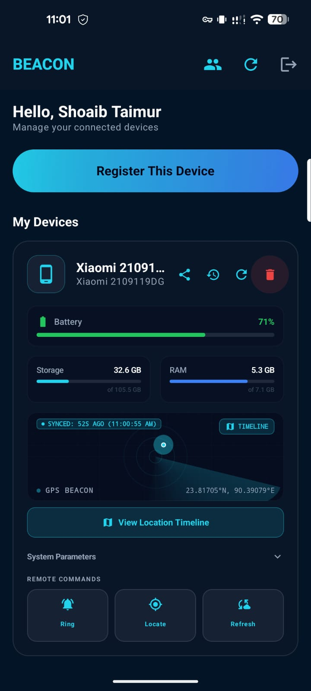
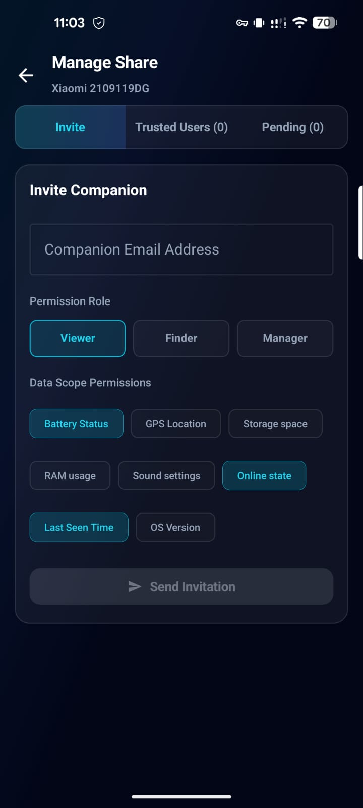

# Project Beacon - Web Dashboard

Project Beacon is a secure, real-time full-stack companion tracking and control system for Android devices. This repository contains the Web Dashboard frontend built with React, Vite, and Tailwind CSS.

## Goal
The goal of Project Beacon is to provide users with a secure, real-time dashboard to monitor device vitals (battery, storage, RAM, sound profile), track location history, and dispatch remote action triggers (ringing silent devices, pulling instant logs, or tracking real-time coordinates) with granular sharing controls.

---

## Features

### 1. Real-Time Vitals Monitoring
- **Battery Status**: Percentage tracker with a dynamic charging state animation.
- **Hardware Utilizations**: Interactive storage & RAM utilization gauges.
- **Hardware Profile**: Active monitoring of system sound modes (Normal, Vibrate, Silent).
- **Connection Indicator**: Instant visual feedback of the device's online/offline network connection.

### 2. Location Tracking & Timeline History
- **Interactive Map**: Renders live device coordinates using Leaflet map view.
- **Location History Timeline**: Select dates to render a chronological path of coordinates on the map.

### 3. Remote Action Dispatcher
- **Audible Ringing**: Make a misplaced silent device sound a high-volume alarm.
- **Instant Locate**: Force the Android background worker to query active GPS/Network coordinates.
- **Log Refresh**: Instantly query current CPU, RAM, storage, and network vitals.

### 4. Granular Sharing Controls
- **Invite Links**: Securely share device visibility with trusted companions.
- **Role-Based Access Control (RBAC)**:
  - **Owner**: Full access, sharing permissions, and deletion controls.
  - **Manager / Finder**: Authorized to dispatch remote actions and track location timelines.
  - **Viewer**: Read-only dashboard panel access to vitals.

---

## Screenshots

### Home Dashboard


### Device History


### Location History Timeline (Dark Mode)


### Location History Timeline (Light Mode)


### Sharing Controls


---

## Tech Stack
- **Framework**: React 19
- **Build Tool**: Vite
- **Styling**: Tailwind CSS v4 (Glassmorphic dark-theme aesthetics)
- **APIs & State**: Axios, React Context API
- **Push Services**: Firebase Client SDK (Cloud Messaging & Auth)

---

## Installation & Setup

### Prerequisites
Make sure you have Node.js (v18+) and npm installed.

### 1. Clone & Install Dependencies
```bash
# Navigate to the frontend directory
cd frontend

# Install packages
npm install
```

### 2. Configure Environment Variables
Create a `.env` file in the root of the `frontend` folder using `.env.example` as a template:
```env
VITE_API_URL=http://localhost:5000/api
VITE_FIREBASE_API_KEY=your_firebase_api_key
VITE_FIREBASE_AUTH_DOMAIN=your_firebase_auth_domain
VITE_FIREBASE_PROJECT_ID=your_firebase_project_id
VITE_FIREBASE_STORAGE_BUCKET=your_firebase_storage_bucket
VITE_FIREBASE_MESSAGING_SENDER_ID=your_firebase_messaging_sender_id
VITE_FIREBASE_APP_ID=your_firebase_app_id
VITE_FIREBASE_VAPID_KEY=your_firebase_fcm_vapid_key
```

### 3. Run Locally (Development)
```bash
npm run dev
```
The application will start running on `http://localhost:5173`.

### 4. Build for Production
```bash
npm run build
```
The minified production assets will be output in the `dist` directory.

---

## Troubleshooting: VPN & Ad-blocker Limitations

Firebase Cloud Messaging (FCM) relies on the Firebase Installations Service (FIS) to register Android device hardware and pull notification tokens.

Active VPNs, DNS-level ad-blockers (like Pi-hole, AdGuard), and device-level ad-blockers/firewalls will block connections to Firebase/Google API endpoints, causing device registration failures (`FIS_AUTH_ERROR`) or rendering remote commands unresponsive.

### Solution:
- Whitelist `firebaseinstallations.googleapis.com` and `fcmregistrations.googleapis.com` in your VPN, DNS filter, or ad-blocker.
- Alternatively, temporarily disable VPNs/Ad-blockers during companion application installation and registration.

---

## Developer
Developed by **Shoaib Taimur** ([taimur.dev](https://taimur.dev)).
